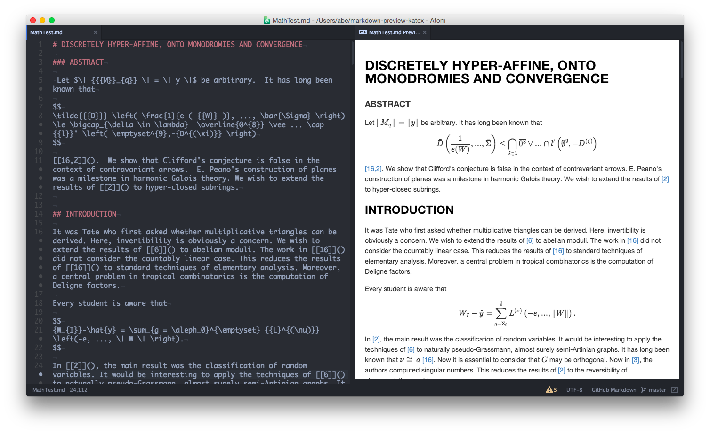

### Who Am I?

* Michael Goetz
* Solutions Engineering Manager @ Chef
* mpgoetz@chef.io
* @michaelpgoetz

### Tests Suck
##### Yours are especially awful
Mine are the worst

### TDD Is Dead

##### I'm not quite dead yet!

### Test Coverage Is A Lie

And a tool of our oppressors

### Why Are We Kidding Ourselves?

### Automation is a Test's best friend

Note: Automation moves quickly, so you have to have a robot check changes. It's impossible to validate all of the integrations and complexities of software at the speed of git commit.

### What is a Test?

### What is a Change?

### How Do You Validate Your Change?

### The 'Type and Look'

### The 'Red-Green'

### The 'Red-Red-Red-Fuck-I'll-Mark-It-As-Pending'

### The 'It's Probably Fine'

### The 'We failed the audit....again'

### Your job isn't to write Tests

It's to deliver business value to your customers

### Tests Are Not Validation
Validation: to establish the **fitness** or **worth** of a software product for its operational
mission.

<small>Barry Boehm</small>

### A Tale of Two Customers

* The primary customer is whoever is consuming on your code - Validation

* The secondary customer is you - Test

### The Primary Customer

* They don't care if your unit test coverage is at 100% if they can't log in.

* Did you write a validation for your primary customer?

* Know how your work contributes to what the primary customer wants and make sure you have a validation for it working properly.

### Who is the Primary Customer?

* Website visitor

* Auditor

* API consumers

* Management

### The Secondary Customer

* Protect your hard work. If your change works on your machine, write whatever test proves it works if someone else checks it out.

* Pick the level of test that proves your work is solid.

### So don't write tests?

Testing the *construction* is not enough. We also must validate the *expectations*</spa> of the customer.

* Determine what validation or test is necessary to serve both customers

* Create something that automatically confirms that expectations are met
